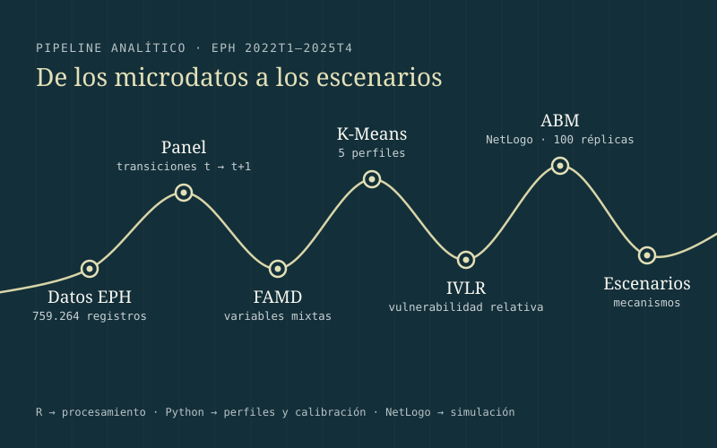
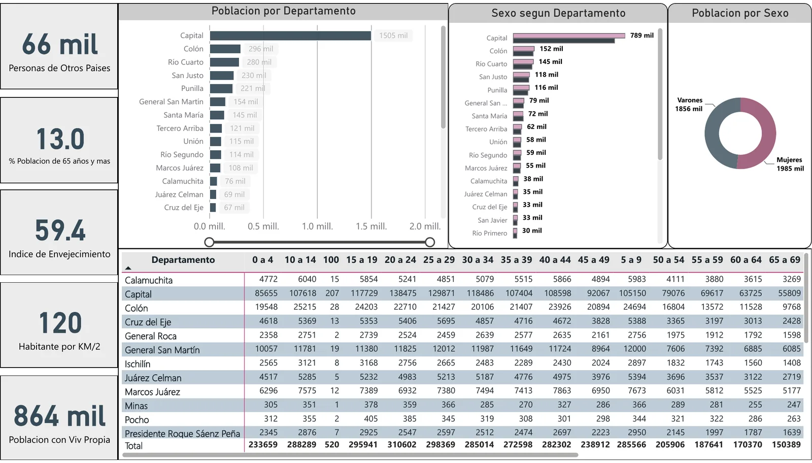
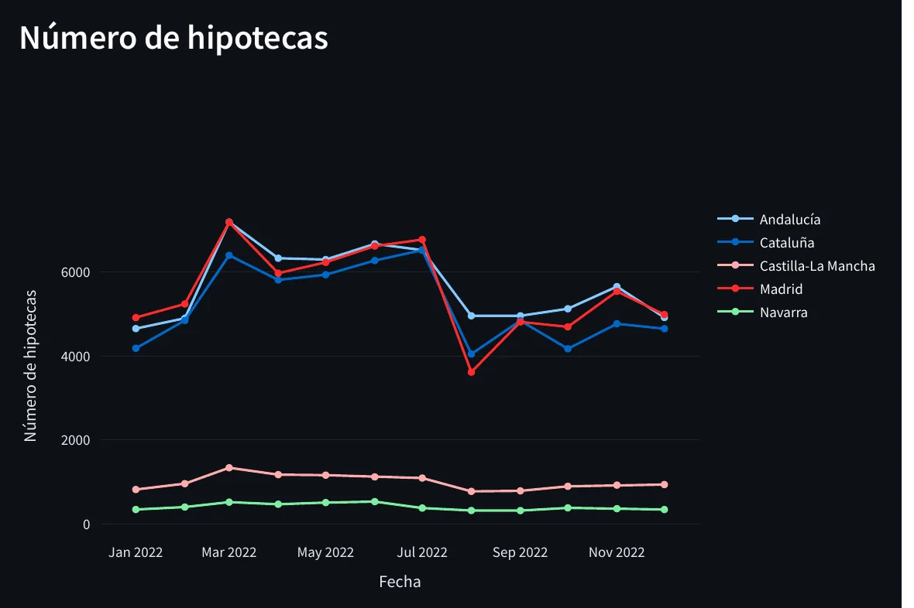
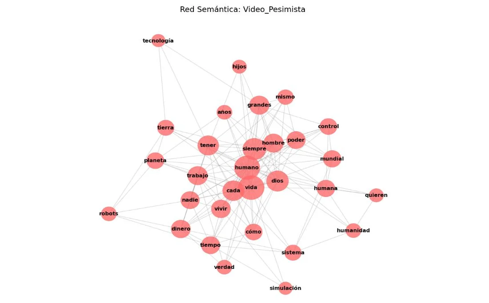

```{=html}
<!-- ============================ HERO ============================ -->
<section class="hero" aria-labelledby="hero-nombre">
  <div class="site-container hero__grid">

    <div class="hero__text">
      <p class="hero__kicker mono-label">SOCIOLOGÍA · DATOS · DECISIONES</p>
      <h1 class="hero__name" id="hero-nombre"><span>Tomás</span><span>Pieroni</span></h1>
      <p class="hero__role">Data Analyst con formación en Sociología y Ciencia de Datos</p>
      <p class="hero__statement">Análisis estadístico, indicadores, reporting y soluciones de datos para comprender problemas y apoyar decisiones.</p>
      <div class="btn-row">
        <a class="btn-tp btn-tp--primary" href="proyectos.html">Ver proyectos</a>
        <a class="btn-tp btn-tp--secondary" href="files/cv-tomas-pieroni-data-analyst.pdf" download>Descargar CV <span class="visually-hidden-text">(PDF)</span></a>
        <a class="btn-tp btn-tp--ghost" href="contacto.html">Contactar</a>
      </div>
    </div>

    <div class="hero__visual">
      <!-- Composición decorativa: no representa datos -->
      <svg class="hero__svg" viewBox="0 0 560 400" aria-hidden="true" focusable="false">
        <path class="line-echo" d="M-40,330 C40,318 70,250 130,262 S220,330 280,262 S360,120 430,150 S520,210 600,120"/>
        <path class="line-main" pathLength="1" d="M-40,300 C30,296 60,214 122,222 S212,300 276,232 S352,96 424,118 S514,170 600,80"/>
        <path class="seg" d="M276,232 C300,262 330,268 356,254"/>
        <path class="seg" d="M424,118 C440,92 468,86 490,94"/>
        <g class="node-group"><circle class="node" cx="122" cy="222" r="8"/><circle class="node-core" cx="122" cy="222" r="3"/><text class="lbl" x="58" y="192">r · automatización</text></g>
        <g class="node-group"><circle class="node" cx="276" cy="232" r="8"/><circle class="node-core" cx="276" cy="232" r="3"/><text class="lbl" x="198" y="292">indicadores · kpis</text></g>
        <g class="node-group"><circle class="node" cx="356" cy="254" r="5"/><text class="lbl" x="370" y="284">sql · postgresql</text></g>
        <g class="node-group"><circle class="node" cx="424" cy="118" r="8"/><circle class="node-core" cx="424" cy="118" r="3"/><text class="lbl" x="300" y="96">power bi · reporting</text></g>
        <g class="node-group"><circle class="node" cx="490" cy="94" r="5"/><text class="lbl" x="440" y="62">python · pandas</text></g>
      </svg>

      <dl class="hero__metrics">
        <div><dt>8 años</dt><dd>de trayectoria en producción y análisis estadístico</dd></div>
        <div><dt>5</dt><dd>proyectos destacados</dd></div>
        <div><dt>6</dt><dd>publicaciones técnicas e institucionales</dd></div>
      </dl>
    </div>
  </div>

  <svg class="hero__drift" viewBox="0 0 1440 140" preserveAspectRatio="none" aria-hidden="true" focusable="false">
    <path d="M0,110 C180,104 260,60 420,72 S700,128 880,96 S1180,30 1440,52"/>
  </svg>
</section>

<!-- ===================== BANDA DE ESPECIALIZACIÓN ===================== -->
<section class="band" aria-label="Áreas de especialización">
  <div class="site-container">
    <ul class="band__list">
      <li>INDICADORES</li>
      <li>REPORTING</li>
      <li>AUTOMATIZACIÓN</li>
      <li>CALIDAD DEL DATO</li>
      <li>VISUALIZACIÓN</li>
    </ul>
  </div>
</section>

<!-- ======================= PROYECTOS SELECCIONADOS ======================= -->
<section class="section" aria-labelledby="titulo-proyectos">
  <div class="site-container">
    <header class="section-head">
      <h2 id="titulo-proyectos">Proyectos seleccionados</h2>
      <p>Análisis, herramientas y sistemas construidos para comprender problemas sociales, territoriales y organizacionales.</p>
    </header>

    <!-- 01 · Montilla -->
    <article class="flagship accent-green" aria-labelledby="p01">
      <div class="flagship__body">
        <div class="flagship__top">
          <span class="project-number" aria-hidden="true">01</span>
          <span class="project-category">INTEGRACIÓN Y VISUALIZACIÓN DE DATOS</span>
        </div>
        <h3 class="project-title" id="p01">Sistema de Análisis Demográfico Municipal</h3>
        <p class="project-subtitle">Integración de fuentes, ETL, modelado relacional, despliegue y visualización de datos para el Ayuntamiento de Montilla.</p>
        <p class="project-desc">Desarrollé procesos ETL en R desde APIs públicas del INE y del IECA, diseñé una base relacional en PostgreSQL y desplegué PostgreSQL y Shiny Server mediante Docker sobre Ubuntu. La solución incluyó un dashboard interactivo, diccionario de datos, documentación técnica y manual de usuario.</p>
        <ul class="tag-list" aria-label="Métodos y herramientas">
          <li class="tag">R</li><li class="tag">ETL</li><li class="tag">PostgreSQL</li><li class="tag">Docker</li><li class="tag">Shiny</li>
        </ul>
        <p><a class="link-arrow" href="proyectos/sistema-demografico-montilla.html">Ver caso completo<span class="visually-hidden-text">: sistema demográfico de Montilla</span></a></p>
      </div>
      <figure class="media-frame">
        
      </figure>
    </article>

    <div class="project-grid project-grid--two">
      <!-- 02 · TFM -->
      <article class="project-card accent-ivory" aria-labelledby="p02">
        <figure class="media-frame">
          
        </figure>
        <div class="project-card__head">
          <span class="project-number" aria-hidden="true">02</span>
          <span class="project-category">ANÁLISIS LONGITUDINAL</span>
        </div>
        <h3 class="project-title" id="p02">Informalidad laboral en Argentina</h3>
        <p class="project-subtitle">Transiciones, segmentación y simulación calibrada empíricamente con microdatos de la EPH.</p>
        <p class="project-desc">759.264 registros de 16 bases trimestrales integrados y validados; cinco perfiles con FAMD y K-Means, el Índice de Vulnerabilidad Laboral Relativa y un modelo basado en agentes para explorar escenarios.</p>
        <ul class="tag-list" aria-label="Métodos y herramientas">
          <li class="tag">R</li><li class="tag">Python</li><li class="tag">FAMD</li><li class="tag">K-Means</li><li class="tag">NetLogo</li>
        </ul>
        <a class="link-arrow" href="proyectos/tfm-informalidad-laboral.html">Ver caso completo<span class="visually-hidden-text">: informalidad laboral en Argentina</span></a>
      </article>

      <!-- 03 · Córdoba -->
      <article class="project-card accent-blue" aria-labelledby="p03">
        <figure class="media-frame media-frame--light media-frame--contain">
          
        </figure>
        <div class="project-card__head">
          <span class="project-number" aria-hidden="true">03</span>
          <span class="project-category">POWER BI · INDICADORES</span>
        </div>
        <h3 class="project-title" id="p03">Córdoba entre dos censos</h3>
        <p class="project-subtitle">Indicadores demográficos y territoriales de los Censos 2010 y 2022 en Power BI.</p>
        <p class="project-desc">Comparación por departamento de población, envejecimiento, densidad, población nacida en otro país y acceso a vivienda propia, agua corriente y cloacas, con árboles de descomposición.</p>
        <ul class="tag-list" aria-label="Métodos y herramientas">
          <li class="tag">Power BI</li><li class="tag">Indicadores</li><li class="tag">Análisis territorial</li><li class="tag">Datos censales</li>
        </ul>
        <a class="link-arrow" href="proyectos/cordoba-censos.html">Ver caso completo<span class="visually-hidden-text">: Córdoba entre dos censos</span></a>
      </article>

      <!-- 04 · Hipotecas -->
      <article class="project-card accent-terra" aria-labelledby="p04">
        <figure class="media-frame">
          
        </figure>
        <div class="project-card__head">
          <span class="project-number" aria-hidden="true">04</span>
          <span class="project-category">APLICACIÓN INTERACTIVA</span>
        </div>
        <h3 class="project-title" id="p04">El pulso mensual del mercado hipotecario español</h3>
        <p class="project-subtitle">Evolución territorial y estacional de los préstamos hipotecarios.</p>
        <p class="project-desc">Aplicación en Streamlit con datos del Colegio Oficial de Notarios para comparar comunidades autónomas e identificar patrones mensuales.</p>
        <ul class="tag-list" aria-label="Métodos y herramientas">
          <li class="tag">Python</li><li class="tag">Streamlit</li><li class="tag">Pandas</li><li class="tag">Plotly</li>
        </ul>
        <a class="link-arrow" href="proyectos/hipotecas-streamlit.html">Ver caso completo<span class="visually-hidden-text">: mercado hipotecario español</span></a>
      </article>

      <!-- 05 · IA en YouTube -->
      <article class="project-card accent-mist" aria-labelledby="p05">
        <figure class="media-frame media-frame--light media-frame--contain">
          
        </figure>
        <div class="project-card__head">
          <span class="project-number" aria-hidden="true">05</span>
          <span class="project-category">NLP Y REDES</span>
        </div>
        <h3 class="project-title" id="p05">Dos idiomas, dos conversaciones sobre inteligencia artificial</h3>
        <p class="project-subtitle">Tópicos y redes semánticas en comentarios en español e inglés.</p>
        <p class="project-desc">6.804 comentarios de YouTube analizados con detección de idioma, sentimiento léxico, modelado de tópicos y redes de coocurrencia.</p>
        <ul class="tag-list" aria-label="Métodos y herramientas">
          <li class="tag">Python</li><li class="tag">LDA</li><li class="tag">Gensim</li><li class="tag">AFINN</li><li class="tag">NetworkX</li>
        </ul>
        <a class="link-arrow" href="proyectos/discursos-ia-youtube.html">Ver caso completo<span class="visually-hidden-text">: discursos sobre IA en YouTube</span></a>
      </article>
    </div>
  </div>
</section>

<!-- ======================== CAPACIDADES ======================== -->
<section class="section section--deep" aria-labelledby="titulo-capacidades">
  <div class="site-container">
    <header class="section-head">
      <h2 id="titulo-capacidades">Capacidades</h2>
      <p>El núcleo es el análisis, los indicadores y la calidad del dato; la analítica avanzada lo complementa.</p>
    </header>
    <div class="capabilities capabilities--five">
      <article class="capability">
        <span class="capability__n" aria-hidden="true">01</span>
        <h3>Análisis estadístico e indicadores</h3>
        <p>Estadística descriptiva y multivariante, análisis longitudinal, segmentación, construcción de índices e interpretación de resultados.</p>
        <p class="tools">R · Python · SPSS · Pandas · Scikit-learn</p>
      </article>
      <article class="capability">
        <span class="capability__n" aria-hidden="true">02</span>
        <h3>Automatización y calidad del dato</h3>
        <p>Procesos reproducibles, integración de fuentes, limpieza, validación, controles de consistencia, documentación y trazabilidad.</p>
        <p class="tools">R · SPSS Syntax · Python · ETL</p>
      </article>
      <article class="capability">
        <span class="capability__n" aria-hidden="true">03</span>
        <h3>BI y visualización</h3>
        <p>Dashboards, KPIs, aplicaciones interactivas e informes para audiencias técnicas y no técnicas.</p>
        <p class="tools">Power BI (DAX, Power Query) · Shiny · Streamlit · Plotly · Superset</p>
      </article>
      <article class="capability">
        <span class="capability__n" aria-hidden="true">04</span>
        <h3>Bases de datos e integración</h3>
        <p>APIs, transformación de datos, modelos relacionales y preparación de información para el análisis.</p>
        <p class="tools">SQL · PostgreSQL · APIs · Docker</p>
      </article>
      <article class="capability">
        <span class="capability__n" aria-hidden="true">05</span>
        <h3>Analítica avanzada</h3>
        <p>Machine Learning aplicado, NLP, redes semánticas y simulación basada en agentes.</p>
        <p class="tools">Scikit-learn · Gensim · NetworkX · NetLogo</p>
      </article>
    </div>
  </div>
</section>

<!-- ============================ TRAYECTORIA ============================ -->
<section class="section paper" aria-labelledby="titulo-trayectoria">
  <div class="site-container">
    <header class="section-head">
      <h2 id="titulo-trayectoria">Una trayectoria cerca del dato real</h2>
      <p>Estadística pública, consultoría privada y Ciencia de Datos: tres frentes que se superponen en el tiempo.</p>
    </header>
    <ol class="trajectory">
      <li>
        <span class="years">2018 – 2026</span>
        <h3>Producción estadística pública</h3>
        <p>Gobierno de Córdoba: de encuestador a supervisor y Data Analyst. Indicadores laborales y sociales, reporting, automatización y calidad del dato.</p>
      </li>
      <li>
        <span class="years">2020 – 2025</span>
        <h3>Analítica aplicada y consultoría</h3>
        <p>Comparactiva, GeoTellus y Alcance: investigación de mercado, estudios de impacto y consultoría de datos con recomendaciones para clientes.</p>
      </li>
      <li>
        <span class="years">2025 – 2026</span>
        <h3>Ciencia de datos aplicada</h3>
        <p>Máster en la Universidad de Granada (9,1/10) y prácticas en el Ayuntamiento de Montilla con una solución de datos de extremo a extremo.</p>
      </li>
    </ol>
    <p style="margin-top:3rem"><a class="link-arrow" href="experiencia.html">Ver experiencia completa</a></p>
  </div>
</section>

<!-- ======================= PUBLICACIONES (SELECCIÓN) ======================= -->
<section class="section section--tight" aria-labelledby="titulo-pubs">
  <div class="site-container">
    <header class="section-head">
      <h2 id="titulo-pubs">Publicaciones seleccionadas</h2>
    </header>
    <ul class="pub-list">
      <li><span class="year">2022 – 2026</span><div><h3>Informe Mensual de Empleo Registrado</h3><p>Serie mensual de análisis estadístico. Gobierno de Córdoba.</p></div><span class="type">INSTITUCIONAL</span></li>
      <li><span class="year">2022 – 2025</span><div><h3>Marco de Bienestar OCDE: brechas de género en salud, educación y empleo</h3><p>Publicación semestral. Gobierno de Córdoba.</p></div><span class="type">INSTITUCIONAL</span></li>
      <li><span class="year">2024</span><div><h3>12 años después: juventud en el entorno laboral</h3><p>Estudio comparativo de los Censos 2010 y 2022.</p></div><span class="type">COAUTORÍA</span></li>
    </ul>
    <p style="margin-top:2.5rem"><a class="link-arrow" href="publicaciones.html">Ver todas las publicaciones</a></p>
  </div>
</section>

<!-- ================================ CTA ================================ -->
<section class="section cta" aria-labelledby="titulo-cta">
  <svg class="cta__line" viewBox="0 0 1440 420" preserveAspectRatio="none" aria-hidden="true" focusable="false">
    <path class="faint" d="M0,360 C200,350 300,250 480,270 S760,380 960,300 S1260,140 1440,170"/>
    <path d="M0,330 C220,322 320,200 500,226 S780,350 980,262 S1270,90 1440,120"/>
  </svg>
  <div class="site-container">
    <div class="cta__inner">
      <h2 id="titulo-cta">Datos, contexto y herramientas para tomar mejores decisiones.</h2>
      <p>Desarrollo análisis y soluciones para integrar fuentes, construir indicadores, automatizar procesos y comunicar resultados complejos con claridad.</p>
      <div class="btn-row">
        <a class="btn-tp btn-tp--primary" href="contacto.html">Contactar</a>
        <a class="btn-tp btn-tp--secondary" href="https://www.linkedin.com/in/tomas-pieroni/">LinkedIn</a>
        <a class="btn-tp btn-tp--ghost" href="files/cv-tomas-pieroni-data-analyst.pdf" download>Descargar CV <span class="visually-hidden-text">(PDF)</span></a>
      </div>
    </div>
  </div>
</section>
```
