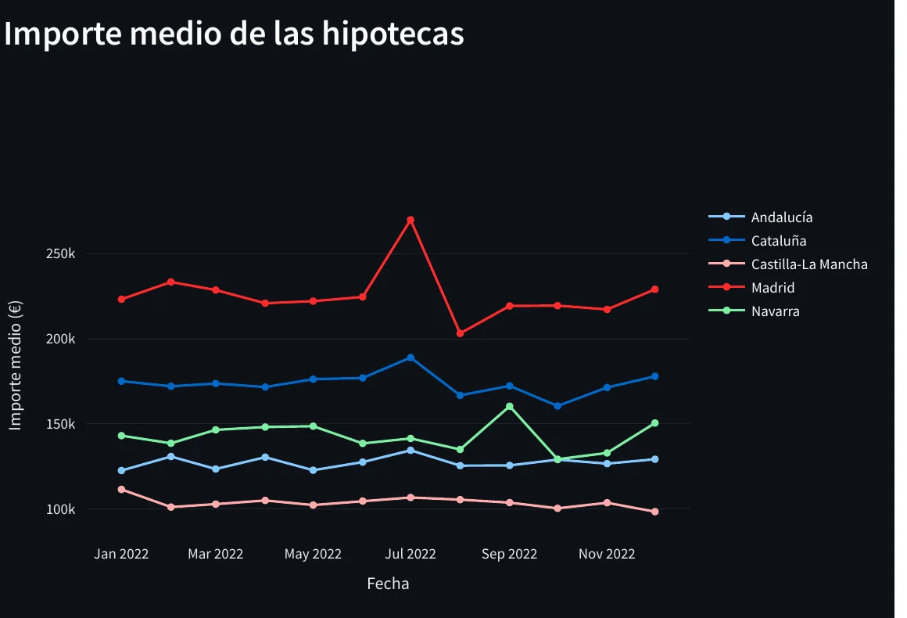
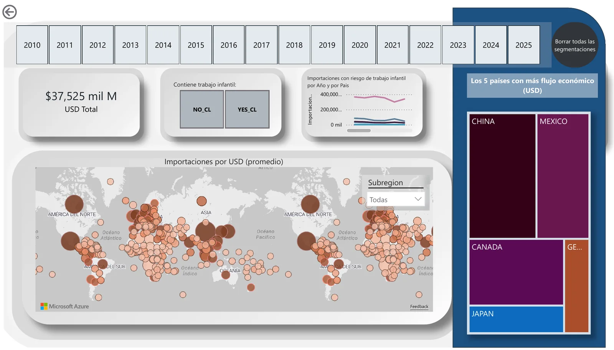
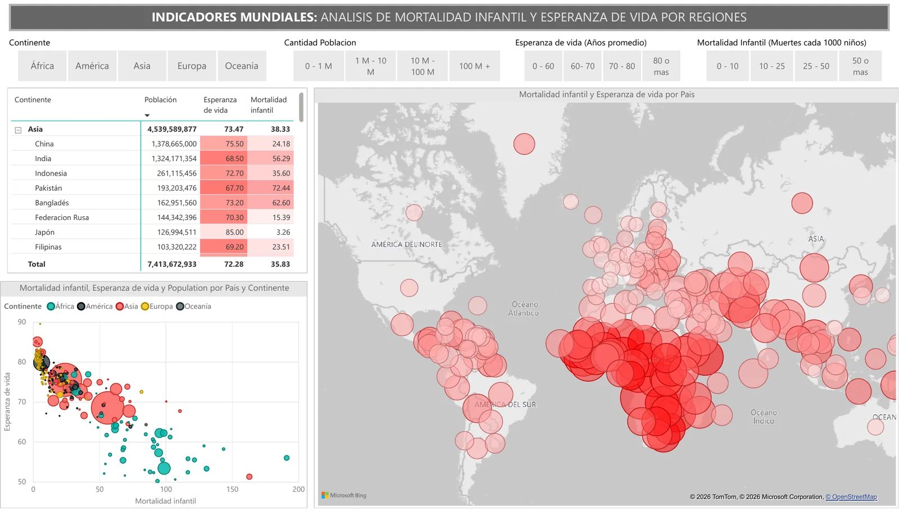

```{=html}
<section class="page-hero" aria-labelledby="titulo-pagina">
  <svg class="page-hero__line" viewBox="0 0 640 260" aria-hidden="true" focusable="false">
    <path d="M0,200 C90,196 120,120 210,132 S330,220 420,150 S540,40 640,70" fill="none" stroke="#D8D5A8" stroke-width="2"/>
    <circle cx="210" cy="132" r="7" fill="#0B1B24" stroke="#E3E0B8" stroke-width="2"/>
    <circle cx="420" cy="150" r="7" fill="#0B1B24" stroke="#E3E0B8" stroke-width="2"/>
  </svg>
  <div class="site-container">
    <p class="mono-label">PROYECTOS</p>
    <h1 id="titulo-pagina">Análisis, herramientas y sistemas</h1>
    <p class="lead">Trabajos en los que combino análisis estadístico, indicadores, construcción de herramientas y comunicación de resultados, siempre con atención al contexto.</p>
  </div>
</section>

<section class="section section--flush-top" aria-label="Proyectos destacados">
  <div class="site-container">

    <article class="project-row accent-green" aria-labelledby="r01">
      <div class="project-row__body">
        <span class="project-number" aria-hidden="true">01</span>
        <p class="project-category">INTEGRACIÓN Y VISUALIZACIÓN DE DATOS · AYUNTAMIENTO DE MONTILLA · 2026</p>
        <h2 class="project-title" id="r01">Sistema de Análisis Demográfico Municipal</h2>
        <p class="project-subtitle">Integración de fuentes, ETL, modelado relacional, despliegue y visualización de datos.</p>
        <p class="project-desc">Una solución de datos de extremo a extremo para integrar fuentes demográficas dispersas y facilitar su análisis por parte de usuarios municipales: ETL en R desde APIs del INE y del IECA, base relacional en PostgreSQL, despliegue con Docker sobre Ubuntu y dashboard en Shiny, con diccionario de datos, documentación técnica y manual de usuario.</p>
        <ul class="tag-list" aria-label="Métodos y herramientas">
          <li class="tag">R</li><li class="tag">ETL</li><li class="tag">PostgreSQL</li><li class="tag">Docker</li><li class="tag">Shiny</li>
        </ul>
        <p><a class="link-arrow" href="proyectos/sistema-demografico-montilla.html">Ver caso completo<span class="visually-hidden-text">: sistema demográfico de Montilla</span></a>
          <a class="link-gh" href="https://github.com/tomaspieroni-cloud/sistema-demografico-montilla">Código en GitHub<span class="visually-hidden-text">: sistema demográfico de Montilla</span></a></p>
      </div>
      <figure class="media-frame project-row__media">
        
      </figure>
    </article>

    <article class="project-row accent-ivory" aria-labelledby="r02">
      <div class="project-row__body">
        <span class="project-number" aria-hidden="true">02</span>
        <p class="project-category">TRABAJO FIN DE MÁSTER · UNIVERSIDAD DE GRANADA · 2026</p>
        <h2 class="project-title" id="r02">Informalidad laboral en Argentina: transiciones, segmentación y simulación</h2>
        <p class="project-subtitle">Análisis descriptivo y longitudinal de trayectorias laborales con microdatos de la Encuesta Permanente de Hogares.</p>
        <p class="project-desc">Integré y validé 759.264 registros de 16 bases trimestrales (2022T1–2025T4). Con FAMD y K-Means identifiqué cinco perfiles de informalidad, construí el Índice de Vulnerabilidad Laboral Relativa y calibré con matrices de transición observadas un modelo basado en agentes en NetLogo para explorar escenarios y analizar mecanismos.</p>
        <ul class="tag-list" aria-label="Métodos y herramientas">
          <li class="tag">R</li><li class="tag">Python</li><li class="tag">FAMD</li><li class="tag">K-Means</li><li class="tag">IVLR</li><li class="tag">NetLogo</li>
        </ul>
        <p><a class="link-arrow" href="proyectos/tfm-informalidad-laboral.html">Ver caso completo<span class="visually-hidden-text">: informalidad laboral en Argentina</span></a>
          <a class="link-gh" href="https://github.com/tomaspieroni-cloud/tfm-informalidad-laboral">Código en GitHub<span class="visually-hidden-text">: informalidad laboral en Argentina</span></a></p>
      </div>
      <figure class="media-frame project-row__media">
        
      </figure>
    </article>

    <article class="project-row accent-blue" aria-labelledby="r03">
      <div class="project-row__body">
        <span class="project-number" aria-hidden="true">03</span>
        <p class="project-category">POWER BI · INDICADORES · ANÁLISIS TERRITORIAL</p>
        <h2 class="project-title" id="r03">Córdoba entre dos censos</h2>
        <p class="project-subtitle">Indicadores demográficos y territoriales de los Censos 2010 y 2022 de la provincia de Córdoba (Argentina).</p>
        <p class="project-desc">Informe en Power BI de seis páginas que compara los dos censos por departamento: población y variación relativa, estructura por sexo y edad, envejecimiento, densidad, población nacida en otro país y acceso a vivienda propia, agua corriente y cloacas, con árboles de descomposición para explorar los cambios.</p>
        <ul class="tag-list" aria-label="Métodos y herramientas">
          <li class="tag">Power BI</li><li class="tag">Indicadores</li><li class="tag">Análisis territorial</li><li class="tag">Datos censales</li>
        </ul>
        <p><a class="link-arrow" href="proyectos/cordoba-censos.html">Ver caso completo<span class="visually-hidden-text">: Córdoba entre dos censos</span></a></p>
      </div>
      <figure class="media-frame media-frame--light media-frame--contain project-row__media">
        
      </figure>
    </article>

    <article class="project-row accent-terra" aria-labelledby="r04">
      <div class="project-row__body">
        <span class="project-number" aria-hidden="true">04</span>
        <p class="project-category">VISUALIZACIÓN INTERACTIVA · 2026</p>
        <h2 class="project-title" id="r04">El pulso mensual del mercado hipotecario español</h2>
        <p class="project-subtitle">Una aplicación para explorar la evolución territorial y estacional de los préstamos hipotecarios.</p>
        <p class="project-desc">Aplicación en Streamlit con datos del Colegio Oficial de Notarios. Filtros por año y comunidad autónoma y cuatro vistas: número de hipotecas, cuantía total, importe medio y estacionalidad mensual.</p>
        <ul class="tag-list" aria-label="Métodos y herramientas">
          <li class="tag">Python</li><li class="tag">Streamlit</li><li class="tag">Pandas</li><li class="tag">Plotly</li>
        </ul>
        <p><a class="link-arrow" href="proyectos/hipotecas-streamlit.html">Ver caso completo<span class="visually-hidden-text">: mercado hipotecario español</span></a>
          <a class="link-gh" href="https://github.com/tomaspieroni-cloud/hipotecas-streamlit">Código en GitHub<span class="visually-hidden-text">: mercado hipotecario español</span></a></p>
      </div>
      <figure class="media-frame project-row__media">
        
      </figure>
    </article>

    <article class="project-row accent-mist" aria-labelledby="r05">
      <div class="project-row__body">
        <span class="project-number" aria-hidden="true">05</span>
        <p class="project-category">ANÁLISIS DE TEXTOS Y REDES SOCIALES · 2026</p>
        <h2 class="project-title" id="r05">Dos idiomas, dos conversaciones sobre inteligencia artificial</h2>
        <p class="project-subtitle">NLP y redes semánticas para comparar los discursos sobre IA generativa en español e inglés.</p>
        <p class="project-desc">6.804 comentarios de YouTube de tres videos con enfoques distintos, analizados con detección de idioma, sentimiento léxico con AFINN, modelado de tópicos con LDA y redes semánticas de coocurrencia.</p>
        <ul class="tag-list" aria-label="Métodos y herramientas">
          <li class="tag">Python</li><li class="tag">LDA</li><li class="tag">Gensim</li><li class="tag">AFINN</li><li class="tag">NetworkX</li>
        </ul>
        <p><a class="link-arrow" href="proyectos/discursos-ia-youtube.html">Ver caso completo<span class="visually-hidden-text">: discursos sobre IA en YouTube</span></a></p>
      </div>
      <figure class="media-frame media-frame--light media-frame--contain project-row__media">
        
      </figure>
    </article>
  </div>
</section>

<section class="section section--deep" aria-labelledby="titulo-otros">
  <div class="site-container">
    <header class="section-head">
      <h2 id="titulo-otros">Otros análisis</h2>
      <p>Trabajos más acotados que muestran otras herramientas y otras preguntas.</p>
    </header>
    <div class="other-list other-list--three">
      <article class="other-item">
        <figure class="media-frame media-frame--light">
          
        </figure>
        <p class="project-category">POWER BI · COAUTORÍA</p>
        <h3>Trabajo infantil en las importaciones de Estados Unidos</h3>
        <p>Dashboard que cruza las importaciones de Estados Unidos entre 2010 y 2025, por país y tipo de bien, con un indicador de riesgo de trabajo infantil: concentración por país, bienes más expuestos y evolución por subregión. Realizado junto a Bianca Carmela Roman.</p>
        <ul class="tag-list" aria-label="Herramientas">
          <li class="tag">Power BI</li><li class="tag">Mapas</li><li class="tag">Indicadores de riesgo</li>
        </ul>
      </article>
      <article class="other-item">
        <figure class="media-frame media-frame--light">
          
        </figure>
        <p class="project-category">POWER BI · INDICADORES</p>
        <h3>Indicadores mundiales de población y salud</h3>
        <p>Dos páginas en Power BI sobre población por continente y país y sobre la relación entre mortalidad infantil y esperanza de vida, con segmentadores por continente, tamaño de población y rangos de cada indicador.</p>
        <ul class="tag-list" aria-label="Herramientas">
          <li class="tag">Power BI</li><li class="tag">Segmentación</li><li class="tag">Mapas</li>
        </ul>
      </article>
      <article class="other-item">
        <p class="project-category">NLP · COMUNICACIÓN POLÍTICA</p>
        <h3>Polarización y negatividad en el discurso político digital</h3>
        <p>Estudio metodológico sobre tópicos, polaridad y polarización en 6.677 comentarios de YouTube. Se presenta como análisis agregado del discurso digital, con atención explícita a su alcance y sus limitaciones.</p>
        <ul class="tag-list" aria-label="Métodos">
          <li class="tag">TF-IDF</li><li class="tag">LDA</li><li class="tag">Análisis de polaridad</li>
        </ul>
      </article>
    </div>
    <p class="more-code">Más código en GitHub: <a href="https://github.com/tomaspieroni-cloud/ejercicios-master-ciencia-datos">ejercicios del Máster en Ciencia de Datos</a> (Pandas, scikit-learn) y <a href="https://github.com/tomaspieroni-cloud/">todos mis repositorios</a>.</p>
  </div>
</section>
```
