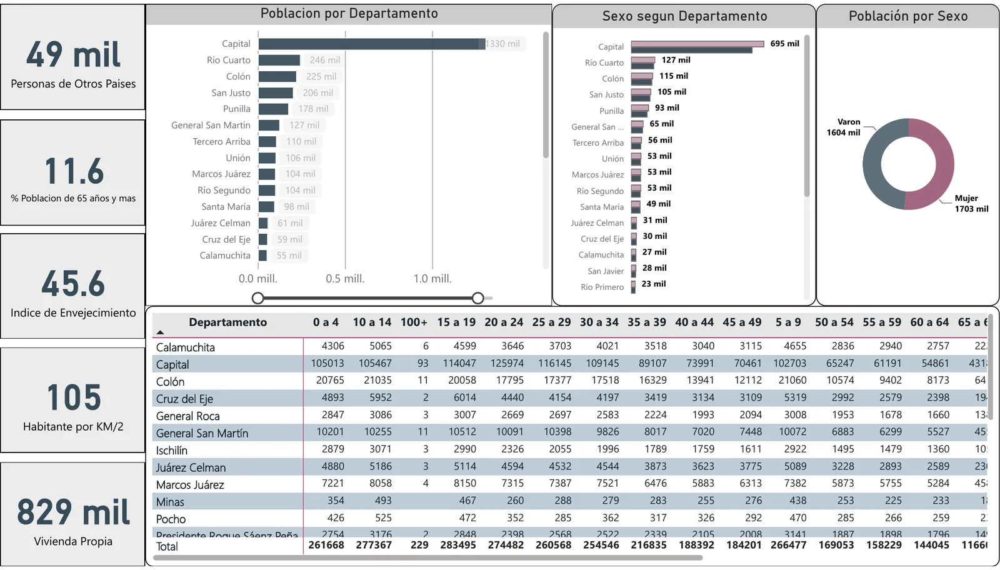
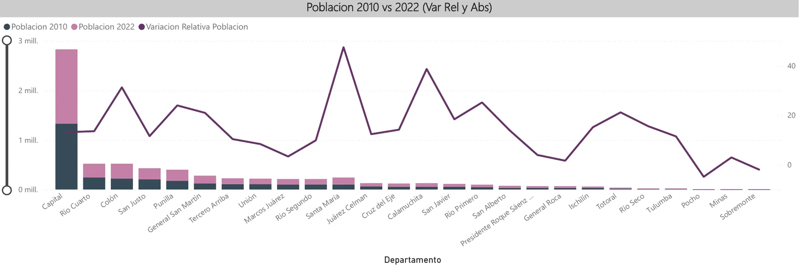
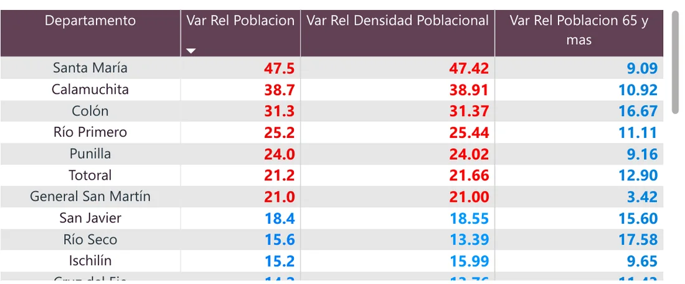
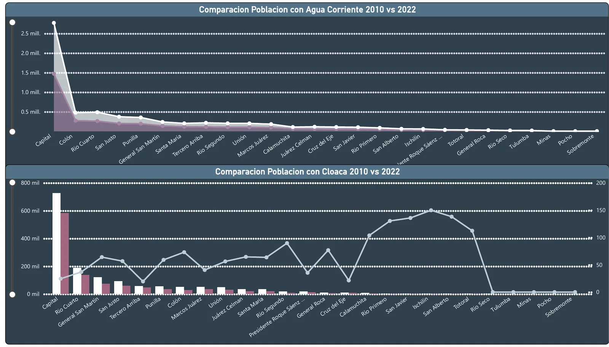

::: {.case-meta}
POWER BI · INDICADORES · ANÁLISIS TERRITORIAL

[Power BI]{.tag} [Modelo de datos]{.tag} [Indicadores]{.tag} [Árboles de descomposición]{.tag} [Datos censales]{.tag}
:::

## Resumen ejecutivo

[Un informe en Power BI que compara los Censos Nacionales de Población, Hogares y Viviendas de 2010 y 2022 en la provincia de Córdoba (Argentina), departamento por departamento, para ver dónde creció la población, cómo cambió su estructura por edad y cómo evolucionó el acceso a servicios básicos.]{.lede}

::: {.stat-row}
::: {}
[3,31 → 3,84 M]{.v} [habitantes en 2010 y en 2022 (+16 %)]{.k}
:::
::: {}
[45,6 → 59,4]{.v} [índice de envejecimiento]{.k}
:::
::: {}
[11,6 → 13,0 %]{.v} [población de 65 años y más]{.k}
:::
:::

## Las preguntas

- ¿Qué departamentos concentraron el crecimiento de la población entre 2010 y 2022?
- ¿Cómo cambiaron la estructura por edad, el envejecimiento y la densidad?
- ¿Cómo evolucionó el acceso a vivienda propia, agua corriente y cloacas en cada departamento?

## Qué hice específicamente

1. Preparé y relacioné las tablas de ambos censos por departamento.
2. Construí indicadores de variación relativa de población, densidad, población de 65 años y más, vivienda propia y acceso a servicios.
3. Diseñé seis páginas: un resumen por censo, árboles de descomposición, el análisis de la variación de población, un anexo por departamento con segmentación por tamaño y una página de servicios básicos.

## Resumen por censo

{.figure-light fig-alt="Página de resumen del Censo 2010: 49 mil personas nacidas en otros países, 11,6 % de población de 65 años y más, índice de envejecimiento de 45,6, 105 habitantes por kilómetro cuadrado, población por departamento y por sexo y tabla por grupos de edad."}

{.figure-light fig-alt="Página de resumen del Censo 2022: 66 mil personas nacidas en otros países, 13,0 % de población de 65 años y más, índice de envejecimiento de 59,4, 120 habitantes por kilómetro cuadrado, población por departamento y por sexo y tabla por grupos de edad."}

Fuente: INDEC, Censos Nacionales de Población, Hogares y Viviendas 2010 y 2022. Unidad: departamentos de la provincia de Córdoba.

## Dónde creció la población

{.figure-light fig-alt="Gráfico combinado con la población de cada departamento en 2010 y 2022 en barras y la variación relativa en una línea; la línea alcanza sus máximos en Santa María, cerca de 47 %, Calamuchita y Colón, y baja de cero en Pocho."}

{.figure-light fig-alt="Tabla con la variación relativa de población, de densidad y de población de 65 años y más por departamento, encabezada por Santa María, Calamuchita, Colón, Río Primero y Punilla."}

## Servicios básicos

{.figure-light fig-alt="Dos gráficos que comparan, por departamento, la población con agua corriente y la población con cloacas en 2010 y 2022, con la Capital muy por encima del resto."}

## Limitaciones

- La comparación entre censos debe considerar los cambios metodológicos entre 2010 y 2022, como el paso de un censo de hecho a uno de derecho.
- Los indicadores son agregados departamentales: no describen diferencias dentro de cada departamento.
- La variación relativa amplifica los cambios en departamentos poco poblados; conviene leerla junto con la variación absoluta.

## Habilidades demostradas

- Modelado de datos y construcción de indicadores en Power BI.
- Diseño de informes para la exploración territorial.
- Lectura crítica de fuentes censales.

```{=html}
<div class="back-link"><a class="btn-tp btn-tp--secondary" href="../proyectos.html">Volver a Proyectos</a></div>
```
