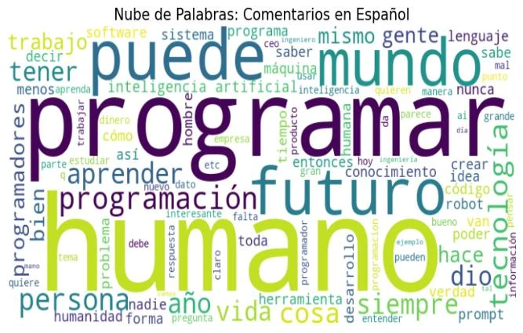
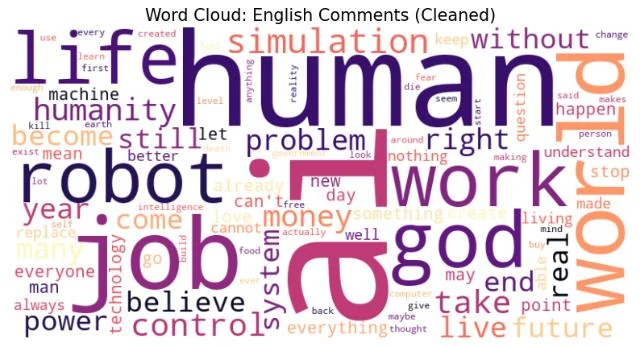
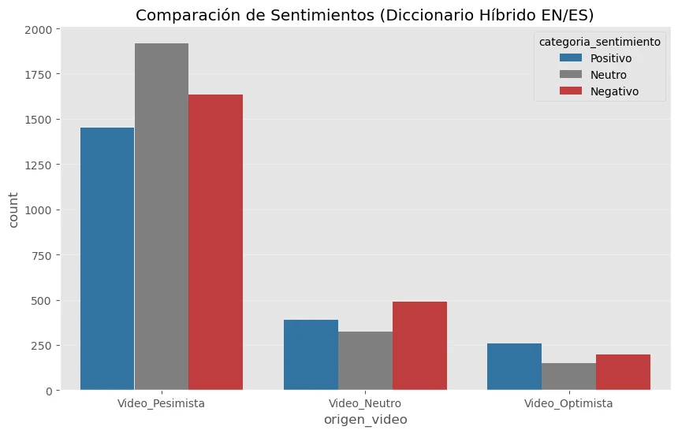
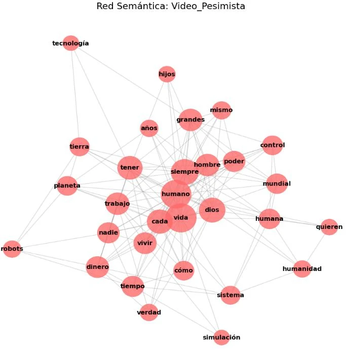
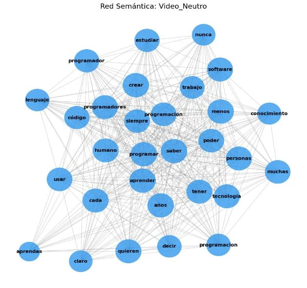
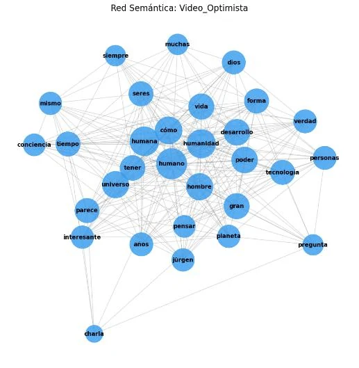

::: {.case-meta}
ANÁLISIS DE TEXTOS Y REDES SOCIALES · MÁSTER DASOC · UNIVERSIDAD DE GRANADA · FEBRERO 2026

[Python]{.tag} [NLTK]{.tag} [Gensim]{.tag} [AFINN]{.tag} [NetworkX]{.tag} [langdetect]{.tag}
:::

## Resumen ejecutivo

[El proyecto analiza cómo se discute la inteligencia artificial generativa en YouTube cuando la conversación ocurre en español y cuando ocurre en inglés. El corpus reúne 6.804 comentarios de tres videos con enfoques distintos (pesimista, neutro y optimista), procesados con minería de texto y análisis de redes.]{.lede}

## El problema

La irrupción de los modelos de IA generativa convirtió un debate técnico en un fenómeno social amplio, atravesado por tensiones laborales, culturales y morales. El proyecto busca identificar si el discurso público es homogéneo o si emergen comunidades discursivas diferenciadas según el idioma y el tipo de contenido.

## Los datos

- 6.804 comentarios de YouTube.
- Tres videos con enfoques distintos: pesimista, neutro y optimista.
- Dos idiomas: español e inglés.
- Variables: texto, cantidad de likes, video de origen e idioma detectado.

## Qué hice específicamente

1. Preprocesamiento textual: minúsculas, limpieza de puntuación y caracteres especiales, normalización de acentos, tokenización y stopwords específicas por idioma.
2. Detección automática de idioma con langdetect.
3. Sentimiento léxico con el diccionario AFINN, en sus versiones en español e inglés.
4. Modelado de tópicos con LDA en Gensim, con modelos separados por idioma.
5. Redes semánticas de coocurrencia con métricas de centralidad y detección de comunidades.

## Hallazgos principales

- **En español**, el debate gira en torno al empleo, la adaptación profesional y la programación: *programar*, *aprender* y *futuro* dominan los tópicos.
- **En inglés** aparecen con más fuerza marcos existenciales y teológicos: *god*, *simulation*, *humans* y *control*.
- El discurso pesimista es más intenso emocionalmente y usa un vocabulario más bélico.
- La red del video optimista es más dispersa: el optimismo se expresa en términos abstractos.

::: {.grid}
::: {.g-col-12 .g-col-md-6}
{.figure-light fig-alt="Nube de palabras de los comentarios en español, dominada por humano, programar, futuro, puede y mundo."}
:::
::: {.g-col-12 .g-col-md-6}
{.figure-light fig-alt="Nube de palabras de los comentarios en inglés, dominada por human, AI, robot, job, work, world y god."}
:::
:::

{.figure-light fig-alt="Gráfico de barras con el número de comentarios positivos, neutros y negativos por video: el video pesimista reúne cerca de 1.450 positivos, 1.900 neutros y 1.630 negativos, mientras que los videos neutro y optimista tienen menos de 500 comentarios por categoría."}

## Redes semánticas

Cada red muestra los términos que aparecen juntos en los comentarios de un mismo video; el tamaño del nodo refleja su centralidad.

::: {.grid}
::: {.g-col-12 .g-col-md-6}
{.figure-light fig-alt="Red semántica del video pesimista con nodos como humano, vida, dios, control, poder, trabajo y dinero."}
:::
::: {.g-col-12 .g-col-md-6}
{.figure-light fig-alt="Red semántica del video neutro, densa, con nodos como programador, código, software, aprender, trabajo y tecnología."}
:::
::: {.g-col-12 .g-col-md-6}
{.figure-light fig-alt="Red semántica del video optimista, más dispersa, con nodos como humano, humanidad, vida, universo y tecnología."}
:::
:::

## Decisión metodológica principal

Implementar todo el pipeline en Python, en lugar de usar herramientas gráficas como Gephi, para garantizar trazabilidad, reproducibilidad e integración en un único flujo de trabajo.

## Resultado

Un análisis que articula emoción, tema y estructura del discurso, documentado con código reproducible y visualizaciones que permiten comparar los corpus.

## Limitaciones

- El análisis léxico no detecta correctamente la ironía ni el sarcasmo.
- Sesgo de selección: los videos se eligieron por su contenido controvertido.
- Desbalance del corpus: un video concentra la mayoría de los comentarios.
- La API de YouTube no recupera comentarios eliminados o marcados como spam.
- Los tópicos no son directamente equiparables entre idiomas y requieren revisión humana.

## Habilidades demostradas

- Procesamiento de texto multilingüe.
- Análisis de sentimiento y modelado de tópicos.
- Redes semánticas y detección de comunidades.
- Integración de técnicas de NLP en un pipeline reproducible.

```{=html}
<div class="back-link"><a class="btn-tp btn-tp--secondary" href="../proyectos.html">Volver a Proyectos</a></div>
```
