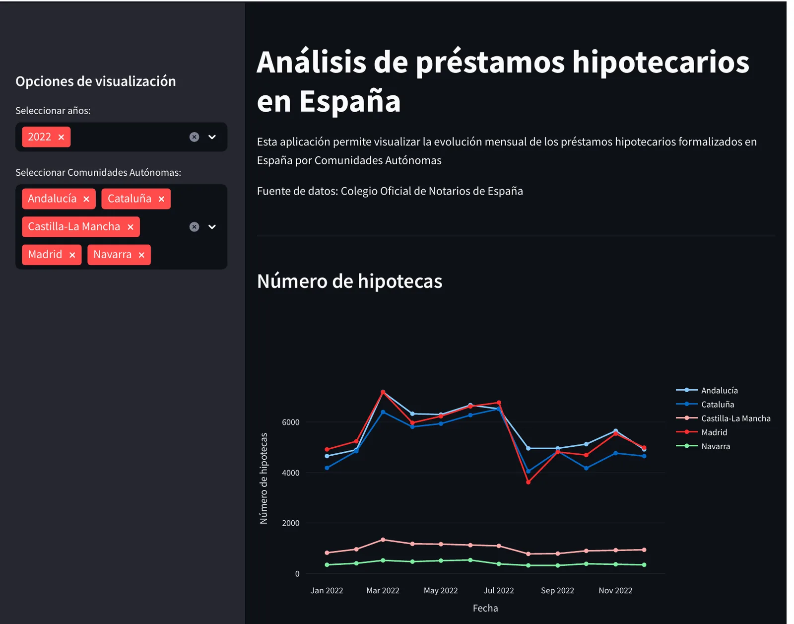
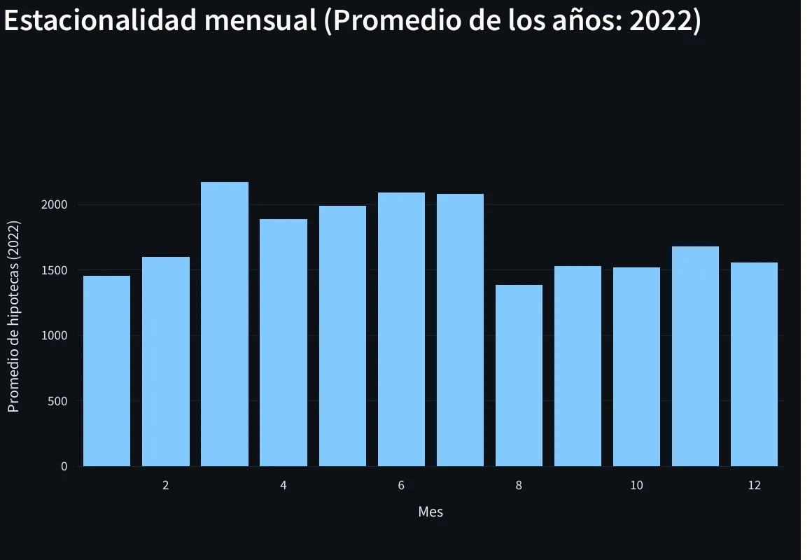

::: {.case-meta}
ANÁLISIS Y VISUALIZACIÓN INTERACTIVA · 2026

[Python]{.tag} [Streamlit]{.tag} [Pandas]{.tag} [Plotly]{.tag} [Series temporales]{.tag}
:::

## Resumen ejecutivo

[Una aplicación interactiva para explorar la evolución territorial y estacional de los préstamos hipotecarios formalizados en España, a partir de datos del Colegio Oficial de Notarios.]{.lede}

{fig-alt="Captura de la aplicación Streamlit sobre fondo oscuro, con filtros de año y comunidad autónoma a la izquierda y un gráfico de líneas con el número mensual de hipotecas en 2022 para Andalucía, Cataluña, Castilla-La Mancha, Madrid y Navarra."}

## El problema

Los datos de préstamos hipotecarios por comunidad autónoma se publican en series largas difíciles de comparar manualmente. El objetivo fue construir una herramienta que permitiera filtrar por año y territorio y detectar patrones estacionales.

## Los datos

- Fuente: Colegio Oficial de Notarios de España.
- Variables: número de hipotecas, cuantía total, año, mes y comunidad autónoma.

## Qué hice específicamente

1. Preparación de los datos con Pandas, incluida una variable de fecha para ordenar la serie.
2. Cálculo del importe medio por hipoteca a partir de la cuantía total.
3. Interfaz en Streamlit con filtros de año y comunidad, y gráficos dinámicos en Plotly.
4. Cuatro vistas analíticas: número de hipotecas, cuantía total, importe medio y estacionalidad mensual promedio.

::: {.grid}
::: {.g-col-12 .g-col-md-6}
{fig-alt="Gráfico de líneas con el importe medio mensual de las hipotecas en 2022: Madrid entre 200.000 y 270.000 euros, Cataluña cerca de 175.000, Navarra cerca de 145.000, Andalucía cerca de 128.000 y Castilla-La Mancha cerca de 103.000."}
:::
::: {.g-col-12 .g-col-md-6}
{fig-alt="Gráfico de barras con el promedio mensual de hipotecas en 2022: máximo en marzo, cerca de 2.200, y mínimo en agosto, cerca de 1.400."}
:::
:::

## Decisión metodológica principal

Elegir Streamlit frente a alternativas más pesadas permitió mantener la aplicación simple, reproducible y fácil de desplegar, sin perder capacidad interactiva.

## Resultado

Una aplicación que permite comparar comunidades autónomas, identificar patrones mensuales y consultar los datos filtrados desde la propia interfaz.

## Limitaciones

- La aplicación no realiza proyecciones ni estimaciones: describe los datos observados.
- La comparación entre comunidades debe considerar las diferencias de tamaño poblacional.
- La actualización depende de la frecuencia de publicación de la fuente original.

## Habilidades demostradas

- Análisis de series temporales territoriales.
- Construcción de aplicaciones interactivas.
- Visualización con Plotly y preparación de datos con Pandas.

```{=html}
<div class="back-link"><a class="btn-tp btn-tp--secondary" href="../proyectos.html">Volver a Proyectos</a></div>
```
