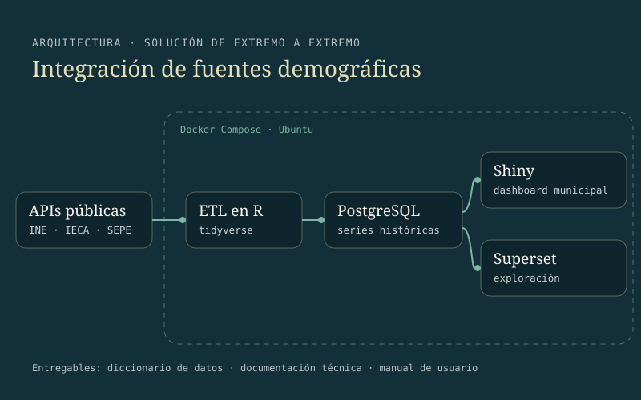

::: {.case-meta}
INTEGRACIÓN Y VISUALIZACIÓN DE DATOS · PRÁCTICAS CURRICULARES · UNIVERSIDAD DE GRANADA · AYUNTAMIENTO DE MONTILLA · MARZO – JUNIO 2026

[R]{.tag} [tidyverse]{.tag} [Shiny]{.tag} [PostgreSQL]{.tag} [Docker]{.tag} [Apache Superset]{.tag} [APIs INE/IECA]{.tag}
:::

## Resumen ejecutivo

[Una solución de datos de extremo a extremo para integrar fuentes demográficas dispersas y facilitar su análisis por parte de usuarios municipales. Desarrollé procesos ETL en R desde APIs públicas del INE y del IECA, diseñé una base relacional en PostgreSQL y desplegué PostgreSQL y Shiny Server mediante Docker sobre Ubuntu. La solución incluyó un dashboard interactivo, diccionario de datos, documentación técnica y manual de usuario.]{.lede}

## El problema

El Ayuntamiento de Montilla trabaja con información procedente de varias fuentes estadísticas oficiales (INE, IECA y SEPE) que históricamente estaban dispersas y sin integrar. La planificación de servicios sociales, la atención a las personas mayores y las políticas de atracción de población joven necesitaban evidencia sistematizada y actualizable.

## Los datos

El sistema integra series históricas de población, estructura por edades, envejecimiento, dependencia, crecimiento natural, migraciones y paro registrado, obtenidas de APIs públicas del INE y del IECA y de portales de datos abiertos.

## Arquitectura

{fig-alt="Diagrama de arquitectura: APIs públicas del INE, IECA y SEPE alimentan un proceso ETL en R que carga una base PostgreSQL; desde ella consultan un dashboard en Shiny y Apache Superset, dentro de un entorno Docker Compose sobre Ubuntu."}

## Qué hice específicamente

Diseñé e implementé la totalidad del proyecto:

1. Extracción y transformación con procesos ETL en R desde APIs públicas.
2. Diseño del modelo relacional en PostgreSQL.
3. Despliegue de PostgreSQL y Shiny Server en contenedores Docker sobre Ubuntu.
4. Desarrollo del dashboard interactivo en Shiny.
5. Exploración de Apache Superset como entorno alternativo de consulta.
6. Diccionario de datos, documentación técnica, manual de usuario y presentación ejecutiva.

## El dashboard

{.figure-light fig-alt="Captura del dashboard en Shiny con pestañas temáticas y dos gráficos: el porcentaje de población joven de 15 a 29 años, en descenso desde cerca del 21 % hasta algo más del 16 %, y el saldo migratorio anual en personas, con una línea vertical en 2021 que separa las fuentes IECA e INE."}

## Decisión metodológica principal

La decisión más importante fue **no ocultar las discrepancias entre fuentes**. Cuando el INE y el IECA ofrecen series con criterios distintos, el sistema las muestra por separado y documenta la diferencia, en lugar de imponer una reconciliación que perdería información sobre cómo se produce cada estadística.

{fig-alt="Dos gráficos de Apache Superset sobre fondo oscuro: la tasa de saldo migratorio entre 2003 y 2024, con las series del INE y del IECA diferenciadas, y el paro registrado por sexo entre 2009 y 2025, con más mujeres que hombres en paro durante todo el periodo."}

## Resultado

Un sistema reproducible que cubre extracción, transformación, almacenamiento, análisis, visualización, despliegue y documentación, entregado a la entidad con manual de usuario y diccionario de datos.

## Limitaciones

- La cobertura temporal depende de la disponibilidad de cada serie en las fuentes originales.
- Algunas series requieren controles manuales de consistencia entre fuentes.
- El sistema está pensado para un municipio; extenderlo a otros exige revisar las correspondencias geográficas.

## Habilidades demostradas

- Integración de fuentes, ETL, modelado relacional, despliegue y visualización de datos.
- Aplicaciones Shiny con lógica reactiva.
- Orquestación de contenedores con Docker Compose.
- Documentación técnica y comunicación con usuarios no técnicos.

```{=html}
<div class="back-link"><a class="btn-tp btn-tp--secondary" href="../proyectos.html">Volver a Proyectos</a></div>
```
