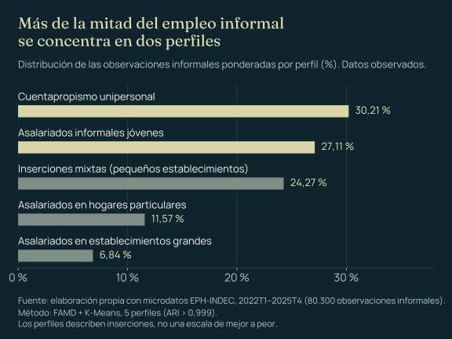
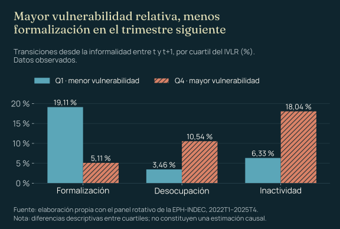
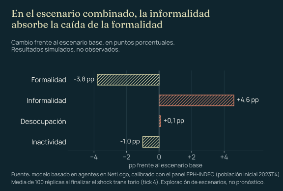

::: {.case-meta}
TRABAJO FIN DE MÁSTER · UNIVERSIDAD DE GRANADA · SEPTIEMBRE 2026

[R]{.tag} [Python]{.tag} [Pandas]{.tag} [Scikit-learn]{.tag} [prince]{.tag} [FAMD]{.tag} [K-Means]{.tag} [NetLogo]{.tag}
:::

## Resumen ejecutivo

```{=html}
<div class="exec-summary" role="group" aria-label="Resumen del proyecto">
  <div><span class="mono-label">PREGUNTA</span><p>¿Cómo reaccionan los distintos perfiles de trabajadores informales ante shocks económicos e institucionales en Argentina?</p></div>
  <div><span class="mono-label">DATOS</span><p>759.264 registros de 16 bases trimestrales de la EPH (2022T1–2025T4), con un panel de 283.246 enlaces.</p></div>
  <div><span class="mono-label">MÉTODO</span><p>FAMD y K-Means para los perfiles, IVLR para la vulnerabilidad relativa y un modelo basado en agentes calibrado con transiciones observadas.</p></div>
  <div><span class="mono-label">HALLAZGO</span><p>Cinco perfiles de informalidad; en el cuartil más vulnerable la formalización es casi cuatro veces menor, y en los escenarios simulados la informalidad absorbe gran parte del ajuste.</p></div>
</div>
<p class="callout-note-tp">La simulación explora escenarios y analiza mecanismos: no pronostica ni predice resultados individuales.</p>
```

## El problema

En el cuarto trimestre de 2025, más de cuatro de cada diez personas ocupadas en los aglomerados urbanos de Argentina tenían un empleo informal. Pero esa tasa agregada reúne situaciones muy distintas: asalariados no registrados, cuentapropistas vulnerables y trabajadores de subsistencia conviven bajo el mismo indicador, con niveles de estabilidad y protección muy desiguales.

La pregunta central del trabajo fue cómo reaccionan los distintos perfiles de trabajadores informales ante shocks económicos e institucionales. Responderla exige mirar dentro de la informalidad: qué tipos de inserción la componen, cómo se mueven las personas entre situaciones laborales y quiénes absorben el ajuste.

## Los datos

El proyecto utiliza microdatos de la Encuesta Permanente de Hogares (EPH-INDEC), representativa de la población urbana de los 31 aglomerados relevados. La ventana de 16 trimestres coincide con un periodo de alta inflación y devaluaciones.

La base analítica se construyó mediante:

- integración y validación de 759.264 registros y 240 variables;
- homogeneización de variables y categorías entre periodos;
- clasificación de las situaciones de formalidad laboral;
- enlace del panel rotativo: 283.246 enlaces consistentes y 128.427 con estados válidos en la ventana principal;
- tratamiento explícito de valores faltantes: los ingresos no respondidos se trataron como faltantes y los declarados en cero se conservaron como observaciones válidas.

## Pipeline analítico

Diseñé e implementé el pipeline completo: procesamiento en R, perfiles y calibración en Python, y simulación en NetLogo.

```{=html}
<ol class="process-full" aria-label="Etapas del pipeline analítico">
  <li><span class="step-n">datos</span><strong>Datos EPH</strong><span class="note">16 bases trimestrales integradas y validadas.</span></li>
  <li><span class="step-n">clasificación</span><strong>Clasificación de formalidad</strong><span class="note">Situación laboral de cada persona ocupada.</span></li>
  <li><span class="step-n">panel</span><strong>Panel longitudinal</strong><span class="note">Enlace de las mismas personas entre trimestres.</span></li>
  <li><span class="step-n">transiciones</span><strong>Transiciones laborales</strong><span class="note">Cambios entre formalidad, informalidad, desocupación e inactividad.</span></li>
  <li><span class="step-n">reducción</span><strong>FAMD</strong><span class="note">Variables numéricas y categóricas en un mismo espacio.</span></li>
  <li><span class="step-n">segmentación</span><strong>Clustering K-Means</strong><span class="note">Cinco perfiles estables (ARI &gt; 0,999).</span></li>
  <li><span class="step-n">índice</span><strong>IVLR</strong><span class="note">Ingreso relativo, intensidad laboral y privación educativa.</span></li>
  <li><span class="step-n">calibración</span><strong>Matrices de transición</strong><span class="note">Probabilidades observadas por perfil y nivel de vulnerabilidad.</span></li>
  <li class="is-sim"><span class="step-n">simulación</span><strong>Modelo basado en agentes</strong><span class="note">NetLogo, población inicial observada en 2023T4.</span></li>
  <li class="is-sim"><span class="step-n">escenarios</span><strong>Simulación de escenarios</strong><span class="note">Shock inflacionario, devaluatorio y combinado; 100 réplicas por escenario.</span></li>
  <li class="is-sim"><span class="step-n">interpretación</span><strong>Análisis de mecanismos</strong><span class="note">Cómo se distribuye el ajuste entre estados laborales.</span></li>
</ol>
```

Las tres últimas etapas, marcadas como simuladas, producen resultados del modelo; el resto trabaja con datos observados.

## La decisión metodológica más importante

La principal decisión fue no tratar la informalidad como una etiqueta aislada ni reducir el proyecto a una clasificación individual. El análisis se organizó en tres niveles complementarios.

### Segmentación multivariante

FAMD permite combinar variables numéricas y categóricas en un mismo espacio, y K-Means sobre ese espacio identifica perfiles sin imponer de antemano categorías de vulnerabilidad. La solución resultó interpretable y muy estable.

### Transiciones laborales

El panel rotativo permite observar qué ocurre con las mismas personas de un trimestre al siguiente y superar una lectura exclusivamente transversal.

### Simulación calibrada empíricamente

Los perfiles, el IVLR y las matrices de transición observadas calibran el modelo basado en agentes. Así, la simulación queda vinculada con patrones de los microdatos en lugar de depender solo de supuestos teóricos.

## Resultados

### La informalidad se compone de cinco perfiles

{fig-alt="Gráfico de barras horizontales con la distribución del empleo informal en cinco perfiles: cuentapropismo unipersonal 30,21 %, asalariados informales jóvenes 27,11 %, inserciones mixtas en pequeños establecimientos 24,27 %, asalariados en hogares particulares 11,57 % y asalariados en establecimientos grandes 6,84 %."}

### La vulnerabilidad relativa condiciona las transiciones

{fig-alt="Gráfico de barras agrupadas que compara transiciones desde la informalidad entre el primer y el cuarto cuartil del IVLR: formalización 19,11 % frente a 5,11 %, desocupación 3,46 % frente a 10,54 % e inactividad 6,33 % frente a 18,04 %."}

### Escenarios simulados

Cambio en la formalidad frente al escenario base, en puntos porcentuales. Son resultados de la simulación, no observaciones.

::: {.stat-row .is-sim}
::: {}
[−2,31 pp]{.v} [Escenario inflacionario moderado]{.k}
:::
::: {}
[−1,2 pp]{.v} [Escenario devaluatorio]{.k}
:::
::: {}
[−3,75 pp]{.v} [Escenario combinado, en su pico]{.k}
:::
:::

{fig-alt="Gráfico de barras divergentes con el cambio simulado frente al escenario base en el escenario combinado: formalidad −3,8 puntos, informalidad +4,6, desocupación +0,1 e inactividad −1,0."}

## Interpretación

El mecanismo que emerge es una amortiguación precaria: ante un shock, la formalización se frena, una parte del ajuste no se transforma en desempleo abierto y se desplaza hacia la informalidad, lo que consolida inserciones con menor protección. Absorber el ajuste no equivale a mejorar la calidad del empleo.

De ahí se desprenden algunas implicancias para la gestión: diseñar políticas diferenciadas por perfil, priorizar las trayectorias más vulnerables, medir flujos y no solo stocks, y usar los perfiles y el IVLR como criterios exploratorios para focalizar y evaluar escenarios antes de implementar medidas.

## Limitaciones e interpretación responsable

- La EPH cubre 31 aglomerados urbanos: los resultados no incluyen el empleo rural.
- La formalidad completa de los trabajadores independientes está disponible desde 2023T4.
- El panel rotativo permite enlaces de corto plazo, no trayectorias de vida completas.
- El clustering identifica estructuras relativas dentro de los datos analizados, y el IVLR permite comparaciones internas, no una medida universal.
- El ABM actualiza estados laborales, pero no incorpora demanda explícita de empresas, salarios ni cambios endógenos en el IVLR.
- Los escenarios expresan consecuencias de los supuestos programados: sirven para comparar mecanismos, no son pronósticos ni efectos causales directos.
- Los resultados agregados no deben utilizarse para determinar el futuro laboral de personas concretas.

## Habilidades demostradas

Procesamiento y validación de microdatos a gran escala, análisis longitudinal, estadística multivariante con datos mixtos, construcción de índices, calibración empírica de simulaciones y comunicación de resultados y de sus límites.

```{=html}
<div class="back-link"><a class="btn-tp btn-tp--secondary" href="../proyectos.html">Volver a Proyectos</a></div>
```
